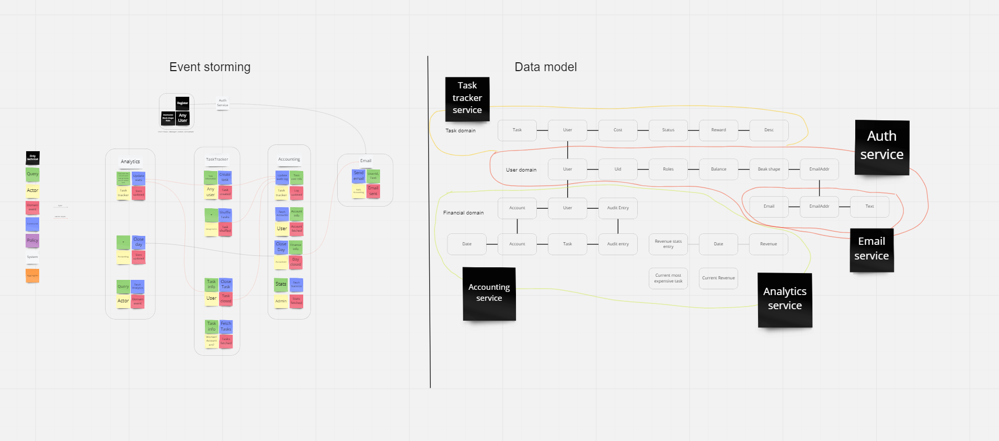

# Вопросы (помещаю сюда для удобства)
- Что если в требованиях вдруг появится понятие дедлайна(то есть таска автозакрывается после какого то времени). Пока у меня есть понятие аккаунтинг дня, но при появлении дедлайна получается что таск трекер тоже должен заиметь собственное понятие времени. Поддержка асинк архитектуры в этом случае выглядит существенно сложнее. Как это лучше организовать?
- Достаточная ли в моем решении атомарность разделения? Например под "Day closed" в аккаунтинге я понимаю несколько вещей выполняющихся внутри сервиса(например создание записей во всех логах о закрытии дня), но выносить их все кажется кроличьей норой ибо можно дойти до написания псевдокода.
- Самая большая сложность возникла именно с отделением бизнес процессов от технических деталей имплементации. Есть ли может какой то rule of thumb чтобы было проще провести дихотомию? Да и нужно ли это вообще?
- В написании кода я хорошо знаком с понятием оверинжиниринга и понимаю что фактически предсказать когда ставка "сыграет" возможно только с опытом. Сложилось ощущение что излишний декаплинг это почти всегда оверинжиниринг. Когда мне надо "продать" оверинжиниринг кода я могу сделать это с помощью вшивания в косты задач. Как продавать архитектурный оверинжиниринг в век аджайла когда принцип "вот завтра POC просто накидай таск трекер с авторизацией и имеилами" потом просто перерастает в то, что в продакшен и идет этот POC.
- В модели данных у меня появилась штука как "Текущая самая дорогая задача". По факту это скорее деталь реализации потому что прямой метод это каждый раз проходиться по всем и выбирать самую дорогую(или сортировать или что то еще). Но я как инженер понимаю что такая штука у меня в сервисе будет ну прямо железно. Имеет ли смысл хватать себя за руку и не вносить такое в модель?
- Я специально не пытался подгонять желаемое под действительное когда разбивал домены на сервисы и получилось что сама информация о юзерах это некоторый God Object в котором хочется хранить буквально все: баланс, список тасок, инфу про аккаунт и пр. Интуиция подсказывает что в таком игрушечном примере как наш это и есть лучший вариант. Вероятнее всего какой то эластиксерч будет весьма успешен в этом до относительно больших размеров сервиса. В реальном проекте это будет иметь далекоидущие(и часто катастрофические) последствия. Какие есть бест практисы в предотвращении таких антипаттернов?
- Могут ли у Бухгалтера быть задачи? (в требованиях я этого не нашел, а методом исключения получается что могут)

# 1. Requirements Analysis
## Task tracker

- Таск-трекер должен быть отдельным дашбордом и доступен всем сотрудникам компании UberPopug Inc. В таск-трекере должны быть только задачи. Проектов, скоупов и спринтов нет, потому что они не умещаются в голове попуга. Каждый сотрудник должен иметь возможность видеть в отдельном месте список заассайненных на него задач.
  - Actor - User
  - Command - Access tasks
  - Data - Task Information (id, desc, status, assignee, cost, progress ect.)
  - Event - User.TasksFetched
- Авторизация в таск-трекере должна выполняться через общий сервис авторизации UberPopug Inc (у нас там инновационная система авторизации на основе формы клюва).
    - Actor - User
    - Command - LoginToTT
    - Data - User Info (uid, beak shape, open Tasks)
    - Event - User.LoggedIn
- Новые таски может создавать кто угодно (администратор, начальник, разработчик, менеджер и любая другая роль). У задачи должны быть описание, статус (выполнена или нет) и рандомно выбранный попуг (кроме менеджера и администратора), на которого заассайнена задача. Wены на задачу определяется единоразово, в момент появления в системе (можно с минимальной задержкой). Деньги списываются сразу после ассайна на сотрудника
    - Actor - User
    - Command - CreateTask
    - Data - Task Info (id, desc, status, assignee, cost, reward, progress ect.)
    - Event - User.TaskCreated
- Менеджеры или администраторы должны иметь кнопку «заассайнить задачи», которая возьмёт все открытые задачи и рандомно заассайнит каждую на любого из сотрудников (кроме менеджера и администратора) . Не успел закрыть задачу до реассайна — сорян, делай следующую.
    - Actor - Manager | Admin
    - Command - Shuffle
    - Data - Task Info, User Info
    - Event - Actor.TasksShuffled
- Каждый сотрудник должен иметь возможность отметить задачу выполненной. Деньги Начисляются после выполнения задачи
    - Actor - User
    - Command - Complete Task
    - Data - Task Info, User Info
    - Event - User.TaskClosed
## Accounting
 - У обычных попугов должен быть доступ только к информации о собственных счетах (аудит лог + текущий баланс). 
    - Actor - Worker
    - Command - FetchAuditLog
    - Data - Audit log, Balance
    - Event - User.AuditLogFetched
 - У админов и бухгалтеров должен быть доступ к общей статистике по деньгам заработанным (количество заработанных топ-менеджментом за сегодня денег + статистика по дням).
    - Actor - Admin | Accountant
    - Command - FetchStats
    - Data - Task Info, User Info
    - Event - Actor.StatsFetched
- Авторизация в таск-трекере должна выполняться через общий сервис авторизации UberPopug Inc (у нас там инновационная система авторизации на основе формы клюва).
    - Actor - User
    - Command - LoginToAc
    - Data - User Info (uid, beak shape, networth, open Tasks)
    - Event - User.LoggedIn
- Отправлять на почту сумму выплаты.
    - Actor - Accounting
    - Command - SendAllBalances
    - Data - Revenue
    - Event - Accounting.EmailsSent
- После выплаты баланса (в конце дня) он должен обнуляться, и в аудитлоге всех операций аккаунтинга должно быть отображено, что была выплачена сумма.
    - Actor - Accounting
    - Command - AwardMoney
    - Data - User Info(uid, beak shape, balance)
    - Event - Accounting.FinancesAwarded

## Analytics

- Аналитика — это отдельный дашборд, доступный только админам.
    - Actor - Admin
    - Command - LoginToAn
    - Data - User Info (uid, beak shape)
    - Event - Admin.LoggedIn
- Нужно показывать самую дорогую задачу за день, неделю или месяц.
    - Actor - Admin
    - Command - FetchAnData
    - Data - Cost History
    - Event - Admin.AnDataFetched

# Miro

https://miro.com/welcomeonboard/RjVJNVFyU3I2SEtLMEhpWHd6U2ZUY1BMZU1IVzZzZ1NZdUc1c3FBSm5HVE1tU21qNkNpNFNiNVdJQm9PWXAyaXwzMDc0NDU3MzQ2MDQ2NjYyOTUxfDI=?share_link_id=733413422784

